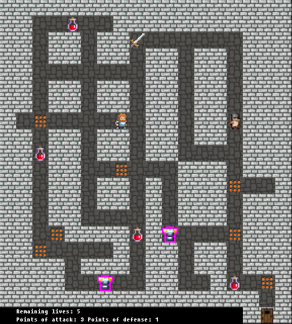
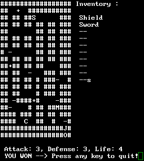

# 2DLabyrinth

Vintage labyrinth game for Linux

## About

This game was developed within our Development techniques courses at the University of Strasbourg. The goal is simple. Manage to get out of the labyrinth before getting destroyed by the monster. Live potions and armors can help to defeat the monster and win the game.

2DLabyrinth has two versions. A full-featured 2D graphical version and a pure textual version playable in a terminal window.

## Build sources

Before compiling the sources (using GCC, Clang or a compatible C compiler), ensure that SDL and Cairo libraries are installed on your system if you intend to build the graphical version of the game.

The libraries can be installed by executing the following command (Debian-based Linux distributions only):

```sudo apt install libsdl* libcairo*```

When the installation finishes, just fire the `make` command from the project's root directory.

If you prefer to compile only one of the two versions, specify the build target as argument to the `make` command as follows:

- `make 2DLabCLI` for the textual version
- `make 2DLabGUI` for the graphical version

## Run

The compilation produces two executable files in the project's root directory:

1. **2DLabCLI** representing the textual version which can be run from a terminal
2. **2DLabGUI** representing the graphical version which can be run by double clicking on the binary file

## Screenshots

### Graphical version



### Textual version



## Documentation

To generate Doxygen-like documentation for the sources, fire the following command:

```doxygen Doxyfile```

Produced HTML documentation will be stored in **doc** folder in the project's root.

## Authors

[Marek Felsoci](mailto:marek.felsoci@etu.unistra.fr) and Thomas Millot, students at the [University of Strasbourg](http://www.unistra.fr).

## License

Our work is licensed under the terms of the GNU General Public Licence vserion 2. See the [LICENSE](LICENSE) file for the full license text.
